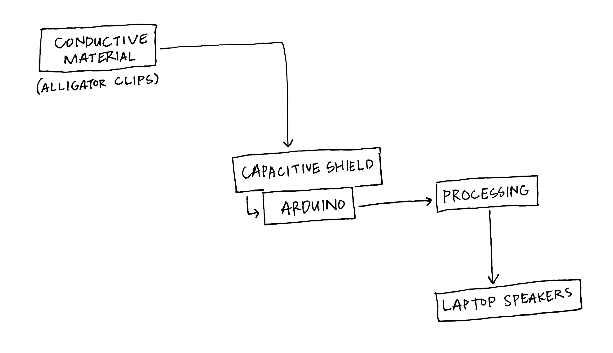
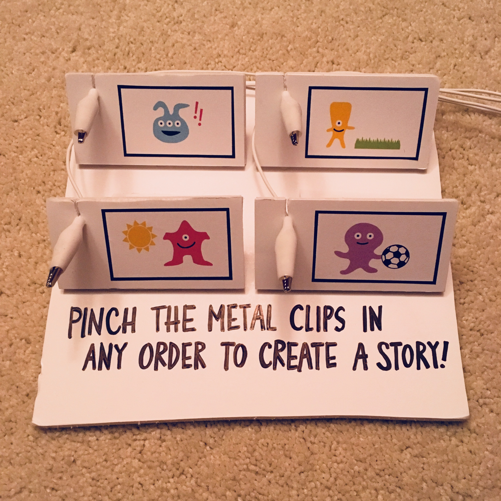

# Storyboard

Play the four audio clips in any order to create a story that will always make sense.

## Summary

I started this process with the idea of recreated the Simon game, which relies on LEDs and buttons. I was advised to use capacitive touch, as the buttons on my breadboard were difficult to press given there was a lot of wiring in the way. After switching to capacitive touch, I was then introduced to the capacitive shield, which requires a lot less wiring but an Arduino Uno board instead.

I took the capacitive shield and Arduino Uno home, with full intentions of making the Simon game, but another idea struck me. That idea was to create a device where kids (and adults) could play and learn by making a story. The device has four audio files, that can be heard in any order by pinching the metal tip of an alligator clip. The order in which the files are played does not affect whether the story is logical. The four sound files are:

- "The weather outside is great!"
- "Let's go outside."
- "I want to play soccer!"
- "Let's play."

Each sound clip is accompanied with a picture to pique children's curiosity.

## Component Parts

Pieces used to build the project include:
- Arduino Uno
- Adafruit Capacitive Shield
- 4 Alligator Clips
- 4 Audio Files (mp3)
- Foam Core or Materials for Holding the Clips

Inputs:
- Exposed Metal of Alligator Clip
- Arduino 
- Processing

Outputs:
- Laptop (Audio)
- Processing (Data)

## Challenges

Because I switched to Arduino Uno, I found out that Arduino needed to "talk" to another program before the audio files could work. I needed to either work in Processing or I must work in Chrome for p5. At first, Processing didn't seem like it would be the answer because it kept freezing/quitting. Finally, with Lei's help and after downloading and trying a numerous libraries, the audio worked with the capacitve touch.

There are still some kinks that need to be ironed out. Each port is assigned one audio clip; however, when the other end of the clip is pinched or squeezed to activate the sound, the wrong audio is played. This seems to be random. Furthermore, capacitive touch seems to be unreliable. Sometimes the audio would play after the clip was squeezed, and sometimes it wouldn't after the same clip was squeezed. I tried using conductive tape and paper clips to see if this would solve the problem, but both failed.

## Timeline

What did you do in each of the past five weeks?

- Week 1: Write proposal
- Week 2: Work on Simon project (LEDs, buttons)
- Week 3: Pivot to "Storyboard" (create concept and audio)
- Week 4: Code and Assemble
- Week 5: Present!

## Completed Work

Included in the repository are the four sound files and a video of how the alligator clips work when pinched/squeezed (without the foam core attached).

## References and links

https://www.adafruit.com/product/2024

https://www.youtube.com/watch?reload=9&v=hkarsyykOsY#action=share
